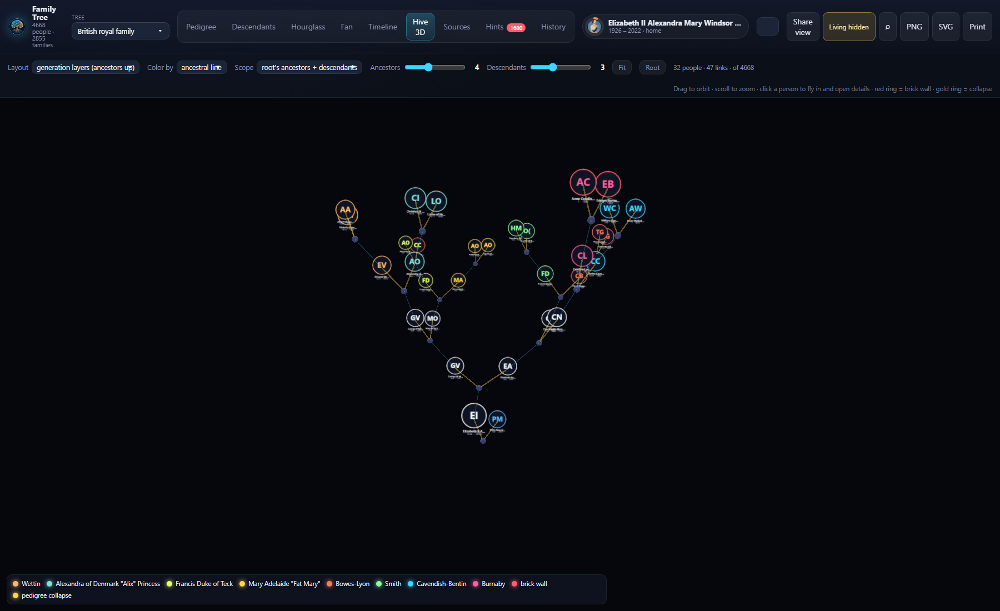
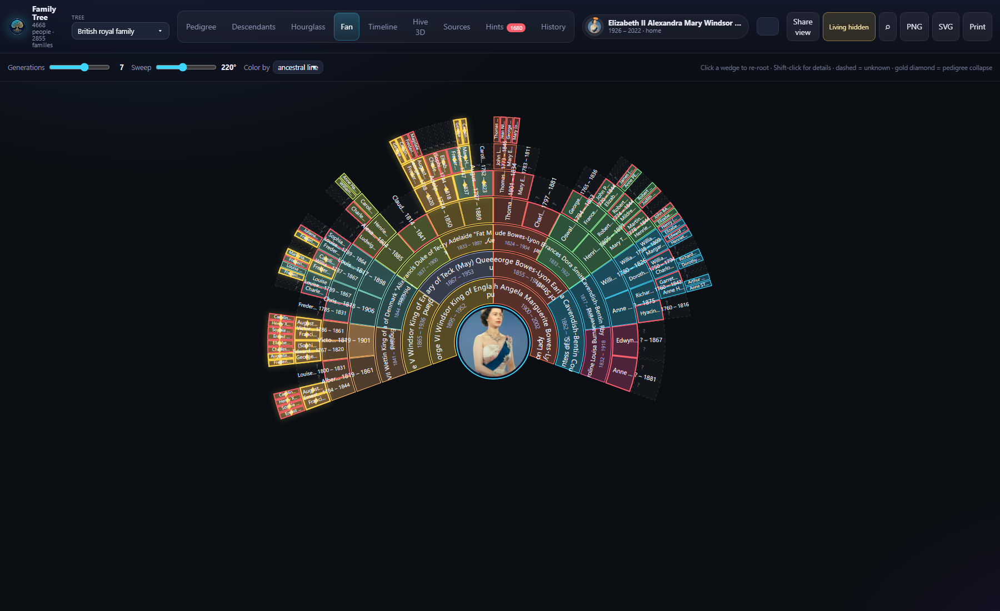
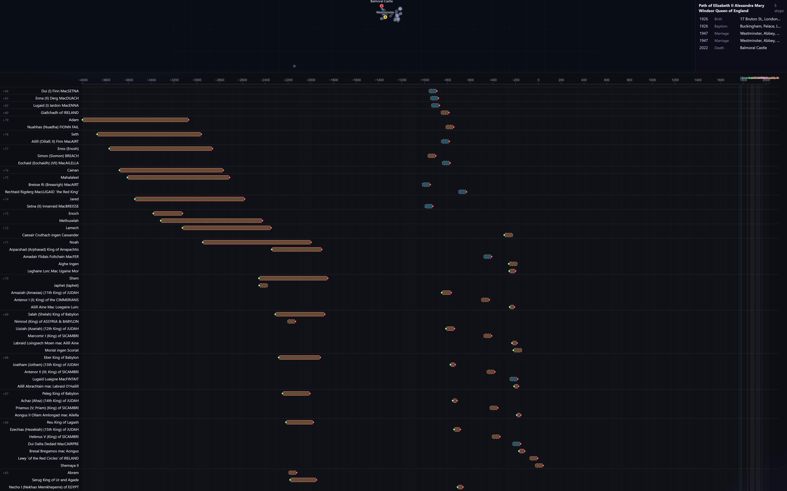
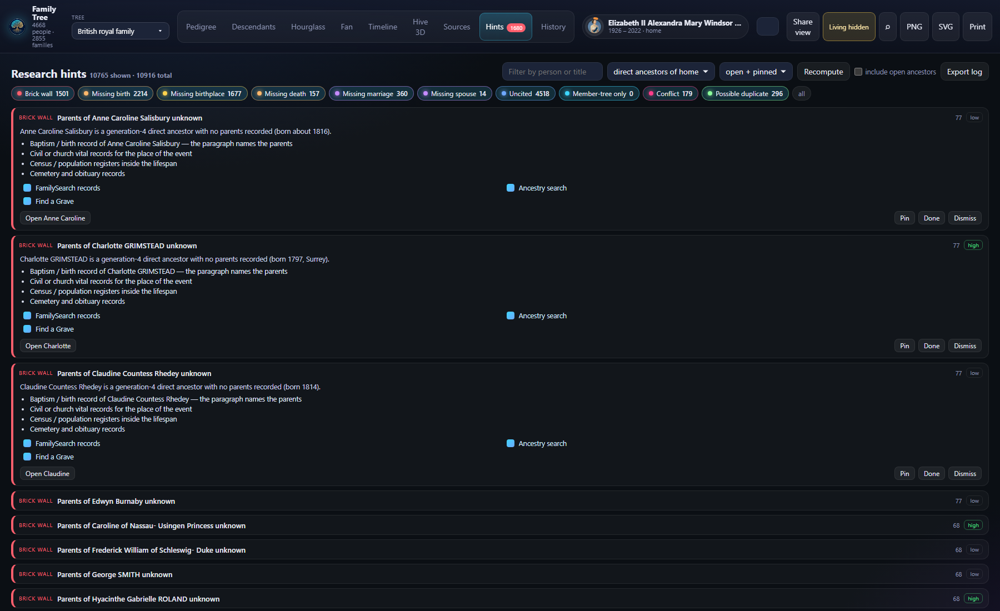
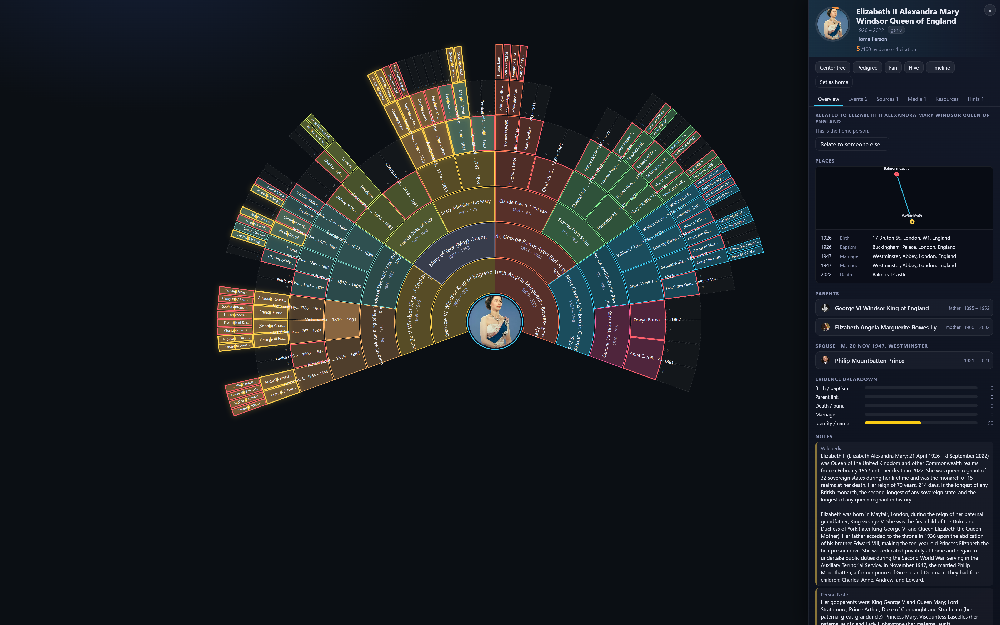

# Family Tree

[](LICENSE)
[](https://nodejs.org/)
[](https://github.com/wtampa/family-tree-viewer/actions/workflows/check.yml)

A local research desk for one genealogist. Import a [Gramps](https://gramps-project.org/) or GEDCOM file, see the whole tree, and work the gaps — without uploading anyone.

Hints flag brick walls, missing vitals, uncited events, and possible duplicates. They do not invent a given name or a parent. Edits live in a SQLite copy on your machine. The original Gramps or GEDCOM file is never overwritten.

Free (MIT). No account. No cloud copy of your tree. The server binds **`127.0.0.1` only**. Do not expose it to the internet, and do not put a real family file on GitHub.

[New to GEDCOM?](docs/START.md) · [User guide](docs/USERGUIDE.md) · [15-minute tutorial](docs/TUTORIAL.md) · [Share a redacted pack](docs/FAMILY.md)

<p align="center">
  
</p>

<p align="center"><em>British royal sample, living people hidden. Hive 3D stacks the tree by generation so brick walls and pedigree collapse are visible at once.</em></p>

## Who it is for

- Gramps users who want a faster view of the same file, without giving up the `.gramps` archive
- Researchers who want a hint list that only reports missing evidence
- Anyone who will not put a living family on a public website

It is not Ancestry, FamilySearch, or a hosted Gramps Web. It does not match records or sync an online tree. Export GEDCOM when you want those sites; keep this app as the local desk.

## What you can do

**See every generation at once.** Portraits sit on the nodes. Brick walls pulse so the next research target is visible. The hive is stacked by generation (ancestors up), not by birth year.

**Fan chart of ancestors.** Dashed wedges are unknown parents. A gold diamond is pedigree collapse — the same person in two ahnentafel slots. The app does not merge two records.

**Evidence score, 0–100**, from the citations already on the person. Weak scores are a research list, not a match to a stranger’s tree. Hints never invent a given name or a parent.

**Your Gramps or GEDCOM file stays an archive.** First open imports it into a local database. Export writes a new timestamped `.gramps` or `.ged`. Pedigree, descendants, hourglass, timeline, sources, and edit history are also here.

Sample trees hide living names, dates, notes, and portraits until you unlock them. A share pack redacts living people even if the desktop toggle is unlocked.

## Screenshots

British royal sample, **Living hidden** on.











## Installation

Needs [Node.js](https://nodejs.org/) 22 or newer.

```bash
git clone https://github.com/wtampa/family-tree-viewer.git
cd family-tree-viewer
npm install
npm run fetch-samples
```

`fetch-samples` downloads the public demo trees into `sample/`. Those downloaded binaries are gitignored. The Simpsons, Duck family, and Harry Potter GEDCOMs are already in the repository. Optional character portraits (not shipped in git):

```bash
npm run fetch-portraits
```

## Quick start

- **Windows:** double-click `Open Family Tree.bat`. It starts Node on `127.0.0.1:5180` and opens a chromeless Edge window. Re-clicking reuses the server. First run installs and builds. Optional desktop icon: right-click `Put Family Tree on Desktop.ps1` → Run with PowerShell.
- **Mac / Linux:** `./start.sh`. It installs and builds if needed, starts Node on `127.0.0.1:5180`, and opens the default browser.
- **Any OS:** `npm run serve`, then open `http://127.0.0.1:5180/`.
- Dev: `npm run dev` (Vite on 5181, proxies `/api`).
- Parser check: `npm run check` or `npm run check -- --all`.

Open a view with a query string: `http://127.0.0.1:5180/?tree=queen&view=hive`. `person=home` opens the home person’s drawer.

Coming from Ancestry with a `.ged` file: [docs/START.md](docs/START.md).

### Your own tree

Copy `settings.example.json` to `settings.json` (gitignored). Set `personalRoot` to the folder that contains `data/data.gramps` or `data/data.ged`. The first load imports that file into `data/tree.db` and never writes the source file again.

## Sample trees

| Tree | Why it’s here | Download |
| --- | --- | --- |
| British royal family | Portraits, pedigree collapse, Hive | `fetch-samples` from [Gramps Web queen demo](https://github.com/DavidMStraub/gramps-web-example-tree-queen) (CC BY-SA 4.0) |
| US Presidents | Compact native `.gramps` | [example-Gramps-Trees](https://github.com/emyoulation/example-gramps-trees) |
| Ingalls (1880) | Tiny census teaching file | example-Gramps-Trees |
| royal92 | Public-domain European royalty | example-Gramps-Trees (Denis R. Reid) |
| The Simpsons, Duck family, Harry Potter | Small public GEDCOMs so you can try the views before pointing the app at your own file | GEDCOM files in this repository |
| Westeros kings | GenoPro public tree | fetched from its [origin URL](https://familytrees.genopro.com/AngelEyes/KINGS/FamilyTree.ged) |

Character faces for the fan trees and Westeros are not in the repository. `npm run fetch-portraits` downloads them from the wiki URLs in each `portraits.json`. See [sample/README.md](sample/README.md).

## Why this exists

GEDCOM and Gramps already store the genealogy. What is still hard is seeing the whole tree, seeing where the citations stop, and editing without a company in the middle.

This app is the overlay: generation views, an evidence score, and a hint dashboard. [Family Plot](https://github.com/oh-kay-blanket/family-plot)’s 3D axis is birth year; this hive is generations (ancestors up). [Gramps Web](https://github.com/gramps-project/gramps-web) is a server you host. This process binds `127.0.0.1` only.

| | Family Tree | [Family Plot](https://github.com/oh-kay-blanket/family-plot) | [Topola](https://github.com/PeWu/topola-viewer) | [Gramps Web](https://github.com/gramps-project/gramps-web) |
| --- | --- | --- | --- | --- |
| 3D layout | generations (ancestors up) | birth year | — | — |
| Edit | local SQLite, undo | GEDCOM edits | view | hosted Gramps |
| Hints | never invents a name | — | — | — |
| Bind | `127.0.0.1` only | local | local / static | server you host |

## Share a read-only tree

**Share view** on the desktop writes a frozen pack. Living people are already labeled **Living**. Relatives do not install Node.

Hosting is optional. A common path is Cloudflare Pages plus Access (an email allowlist): lock the door before you upload, and never put `tree.db` on GitHub. The click-by-click lock-then-upload steps are in [docs/FAMILY.md](docs/FAMILY.md).

## Data model

Gramps XML and GEDCOM import into one JSON model. My tree is stored in SQLite (`people`, `families`, `events`, `places`, `citations`, `sources`, `notes`, `media`, plus undo and history tables). Details: [docs/DATA.md](docs/DATA.md).

## Tutorial

New to genealogy files: [docs/START.md](docs/START.md). Fifteen minutes on the royal sample: [docs/TUTORIAL.md](docs/TUTORIAL.md).

## Citation

If you use this app in writing, cite the repository. Metadata is in [CITATION.cff](CITATION.cff).

```bibtex
@software{familytreeviewer,
  title = {Family Tree},
  author = {wtampa},
  year = {2026},
  url = {https://github.com/wtampa/family-tree-viewer},
  version = {1.0.0},
  license = {MIT}
}
```

## Contributing

See [CONTRIBUTING.md](CONTRIBUTING.md). Behavior toward other people: [CODE_OF_CONDUCT.md](CODE_OF_CONDUCT.md).

## Security

Localhost only. Reporting a leak or a bind-address bug: [SECURITY.md](SECURITY.md).

## License and acknowledgments

Viewer code is MIT ([LICENSE](LICENSE)).

- British royal sample: [DavidMStraub/gramps-web-example-tree-queen](https://github.com/DavidMStraub/gramps-web-example-tree-queen), CC BY-SA 4.0
- Presidents, Ingalls, royal92: [emyoulation/example-Gramps-Trees](https://github.com/emyoulation/example-gramps-trees)
- Westeros kings GEDCOM: public GenoPro tree by AngelEyes
- Charts: [family-chart](https://github.com/donatso/family-chart), [D3](https://d3js.org/), [Three.js](https://threejs.org/)

Character portraits, when you fetch them, stay under the license of the wiki file you downloaded. This repository does not grant rights to those images.
